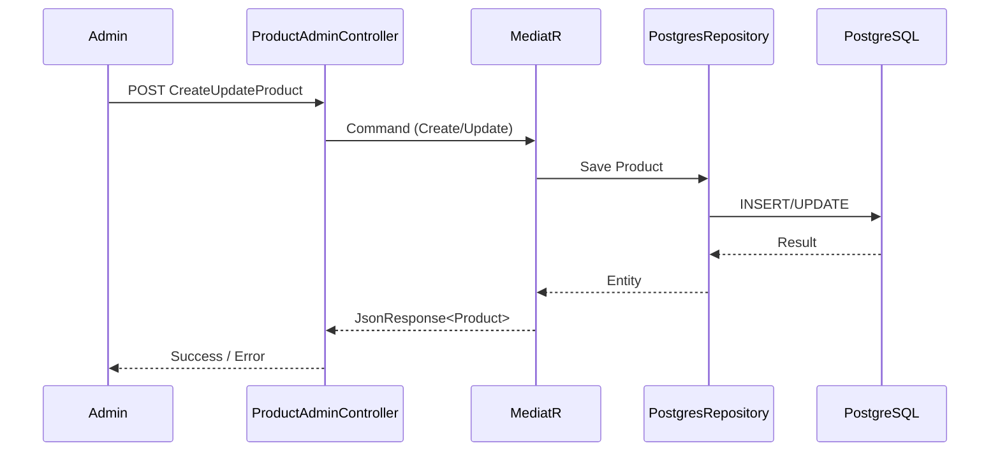

# 🚀 Cyber Store SVC

## 📌 Overview
**Cyber Store SVC** is a backend microservice for **multi-channel e-commerce management**.  
It handles **products, orders, categories**, and integrates with **PostgreSQL, Redis, Kafka, Telegram Bot, Google Cloud**.  

The service follows **CQRS + MediatR architecture**, making it scalable, extensible, and easy to integrate into larger microservices ecosystems.  

---

## ⚙️ Tech Highlights
- **.NET 8 (ASP.NET Core Web API)**  
- **CQRS & Mediator Pattern** (command/query separation)  
- **PostgreSQL + Redis** (transactional + caching)  
- **Kafka + Zookeeper** (event-driven communication)  
- **JWT Authentication & Role-based Access** (custom `[Auth("ADMIN")]`)  
- **FluentValidation, Swagger/OpenAPI** (validation & API docs)  
- **Docker Compose & Swarm** (multi-service deployment, scaling)  

---

## 📂 Core Modules
- **Auth** → Custom JWT & role-based middleware  
- **Controllers** → API for Admin & Web endpoints  
- **Mediator** → Commands, Queries, Handlers (CQRS implementation)  
- **Repository** → Generic data access layer (Postgres)  
- **Services** → Kafka Producer/Consumer, TelegramBot notifications  
- **Utils** → ID generator, file import/export, data converter  

---

## 🔑 Features
- ✅ **Authentication & Authorization** (role-based)  
- ✅ **Product CRUD + Query Engine** (dynamic Postgres query support)  
- ✅ **Order & Category Management**  
- ✅ **Integration with Kafka** (event streaming & async processing)  
- ✅ **Redis Caching** (performance optimization)  
- ✅ **Telegram Notifications** (real-time alerts)  

---

## 📊 System Flow Example (Product Management)

---

## 📈 Business Context & Roadmap
- **Target**: Manage multi-channel sales (Shopee, Lazada, TikTok Shop).  
- **Designed For**: SMBs & enterprises needing centralized product/order management.  
- **Future Plans**:  
  - Multi-tenant support (OmniSync organization-level)  
  - AI-based semantic search (Qdrant + embeddings)  
  - Analytics & reporting APIs for sellers  
  - Webhook sync & retry logic for external marketplaces  

---

## 🏆 Key Strengths
- **Clean architecture** → CQRS + MediatR + Repository pattern  
- **Enterprise-ready stack** → Kafka, Redis, PostgreSQL, Docker Swarm  
- **Scalable & Extensible** → Ready to evolve into a SaaS platform  
- **Secure** → JWT, RBAC, centralized Auth  
